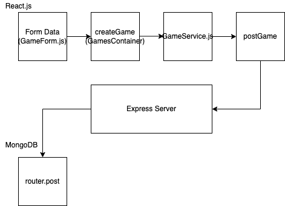

## Q1. What is responsible for defining the routes of the games resource?
The create_router.js is what is responsible for defining the routes

## Q2. What do you notice about the folder structure? Whats the client responsible for? Whats the server responsible for?

Client is responsible for the front end and the displaying of the data and server is repsonsible for the back end and dealing with the database.

## Q3. What are the the responsibilities of server.js?
The server.js file is responisble for configuring the server. It creates a starting point for the routes and well as the port that the server will use.

## Q4. What are the responsibilities of the gamesRouter?
It takes the routes defined in create_router.js and links it with the data in gamesCollection database.

## Q5. What process does the the client (front-end) use to communicate with the server?
GameService.js is responisble for commuicating to the server.

## Q6. What optional second argument does the fetch method take? And what is it used for in this application? Hint: See Using Fetch on the MDN docs

The second argument is an init argument where you can have an object that you can customise to apply to the request. Methods include: method, headers, body, mode, credentials, omit, same-origin, include, cache, redirect and more!?

## Q7. Which of the games API routes does the front-end application consume (i.e. make requests to)?

It makes requests to http://localhost:5000/api/games/

## Q8. What are we using the MongoDB Driver for?

node.js

## Q9. Why do we need to use ObjectId from the  mongoDB driver?

It is because that is the unqine identifier used to identify entries of data in mongoDB